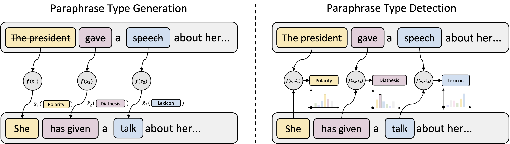

# Paraphrase Types for Generation and Detection

[](https://arxiv.org/abs/2310.14863)
[](https://huggingface.co/spaces/jpwahle/paraphrase-type-tasks)
[](https://huggingface.co/datasets/jpwahle/etpc)



## The Repository

This repository implements the EMNLP'23 paper "Paraphrase Types for Generation and Detection".

## Demo

A demonstration for Paraphrase Type Generation with an interactive chat window can be found on [HuggingFace Spaces](https://huggingface.co/spaces/jpwahle/paraphrase-type-tasks).

## Data

The preprocessed ETPC dataset with paraphrase types can be found on [HuggingFace Datasets](https://huggingface.co/datasets/jpwahle/etpc).
Data card and loading scripts are under `etpc/`.

## Fine-Tuning

### Fine-tune generation models

You can use the `src/finetune_generation.py` script to train the generation models. Here is an example of how to use it:

```bash
python3 src/finetune_generation.py --model_nane <model_name> --task_name <task_name> --device <device>
```

Replace `<model_name>`, `<task_name>`, and `<device>` with your specific values.

* `<model_name>`: The name of the pre-trained model on HF.
* `<task_name>`: Paraphrase Type Generation or regular Paraphrase Generation.
* `<device>`: CUDA, CPU, or MPS (for Apple Silicon)

For more details on the parameters, refer to the script `src/finetune_generation.py`.

### Fine-tune detection models
You can use the `src/finetune_detection.py` script to train the detection models. Here is an example of how to use it:

```bash
python3 src/finetune_detection.py --model_nane <model_name> --task_name <task_name> --device <device>
```

Replace `<model_name>`, `<task_name>`, and `<device>` with your specific values.

* `<model_name>`: The name of the pre-trained model on HF.
* `<task_name>`: Paraphrase Type Detection or regular Paraphrase Detection.
* `<device>`: CUDA, CPU, or MPS (for Apple Silicon)

For more details on the parameters, refer to the script `src/finetune_detection.py`.

### Slurm

If you are using a slurm cluster for managing resources, see `slurm_cls.sh` and `slurm_gen.sh`.

## Prompt-based learning with LLMs

To generate prompts for both type generation and detection, execute `src/generate_prompts_etpc.py`.
This will create four files: `detection_train.jsonl`, `detection_test.jsonl`, `generation_train.jsonl`, and `generation_test.jsonl`. These files are used for training and testing detection and generation respectively. You can generate prompts for QQP analogous using `src/generate_prompts_qqp.py`.

### LLaMA

To run LLaMA, execute `src/llama_generation.py` or `src/llama_detection.py`.

```bash
python3 -m torch.distributed.run --nproc_per_node 8 src/llama_generation.py --ckpt_dir <ckpt_dir> --tokenizer_path <tokenizer_path> --data_file <data_file>
```

Replace `<ckpt_dir>`, `<tokenizer_path>`, `<dataset_name>`, and `<params>` with your specific values.

* `<ckpt_dir>`: The directory where the model checkpoints are stored after downloading from the [LLaMA repo](https://github.com/facebookresearch/llama).
* `<tokenizer_path>`: The path to the tokenizer used by the model.
* `<data_file>`: The file containing prompts and completions.

For running LLaMA with slurm, use `slurm_llama_gen.sh` and `slurm_llama_cls.sh`.

To finetune LLaMA, follow instructions [here](https://github.com/facebookresearch/llama-recipes#multiple-gpus-one-node).
You can load the fine-tuned model with `<ckpt_dir>` to compare to the prompted model.
Under `src/llama_transfer.py`, you can test the prompted and fine-tuned model on other paraphrase tasks (e.g., PAWS).

### ChatGPT

To fine-tune ChatGPT-3.5, execute `src/finetune_chatgpt.py`. Specify either the `detection_train.jsonl` or `generation_train.jsonl` file that was generated using the `generate_prompts_*` scripts.

Evaluating the fine-tuned model on paraphrase type generation and detection can be achieved by running `src/eval_type_detection_chatgpt.py` and `src/eval_generation_chatgpt.py` and providing the `<model_id>` of the finetuned model and the `<data_file>` which can be `generation_test.jsonl` or `detection_test.jsonl`.

To evaluate on qqp, run `src/eval_detection_chatgpt.py` and use `src/eval_generation_chatgpt.py` with the other generated prompt files.

## Contributing

There are many ways in which you can participate in this project, for example:

* [Submit bugs and feature requests](https://github.com/jpwahle/emnlp23-paraphrase-types/issue), and help us verify as they are checked in
* Review [source code changes](https://github.com/jpwahle/emnlp23-paraphrase-types/pulls)

## Citation

```bib
@inproceedings{wahle-etal-2023-paraphrase,
	title        = {Paraphrase Types for Generation and Detection},
	author       = {Wahle, Jan Philip and Gipp, Bela and Ruas, Terry},
	year         = 2023,
	month        = dec,
	booktitle    = {Proceedings of the 2023 Conference on Empirical Methods in Natural Language Processing},
	publisher    = {Association for Computational Linguistics},
	address      = {Singapore, Singapore}
}
```

If you use the ETPC dataset, please also cite:

```bib
@inproceedings{kovatchev-etal-2018-etpc,
    title = "{ETPC} - A Paraphrase Identification Corpus Annotated with Extended Paraphrase Typology and Negation",
    author = "Kovatchev, Venelin  and
      Mart{\'\i}, M. Ant{\`o}nia  and
      Salam{\'o}, Maria",
    booktitle = "Proceedings of the Eleventh International Conference on Language Resources and Evaluation ({LREC} 2018)",
    month = may,
    year = "2018",
    address = "Miyazaki, Japan",
    publisher = "European Language Resources Association (ELRA)",
    url = "https://aclanthology.org/L18-1221",
}
```

## License

Licensed under the [Apache 2.0](LICENSE.txt) license.
Parts of the code under src/llama are licensed under the [LLaMA Community License Agreement](https://github.com/facebookresearch/llama/blob/main/LICENSE)
